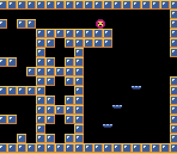

# Pyxel Platformer!

This is a simple platformer test that I made to practice with Pyxel, a retro Python game engine. Your objective is to get to the green portal at the end. It is very long, and at times very difficult, but it is possible. You are free to use this as a template for your own games, but please give credit.

## Controls:
- Move left: left arrow
- Move right: right arrow
- Jump: up arrow
